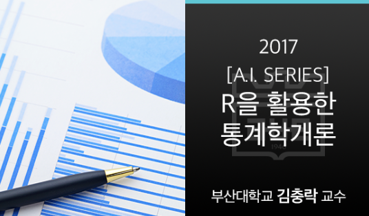

## R을 활용한 통계학개론

### Contents
- Week01 [01장] 모집단과 표본
- Week02 [02장] 자료의 정리
- Week03 [03장] 확률
- Week04 [04-1장] 확률분포
- Week05 [04-2장] 확률분포
- Week06 [05-1장] 통계적 추론
- Week07 [05-2장] 통계적 추론
- Week08 [06장] 두 모집단의 비교
- Week09 [07장] 회귀분석
- Week10 [08장] 범주형 자료의 분석
- Week11 [09장] 분산분석
- Week12 [10장] 비모수 통계학
- Week13 [11장] 모의실험 및 통계적 근사
